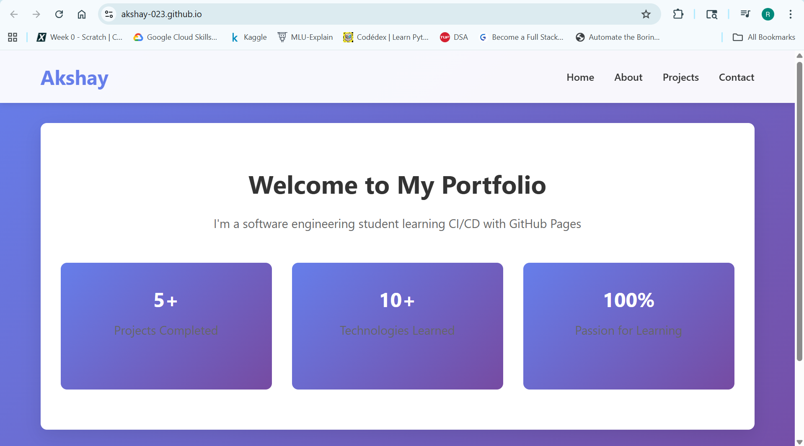
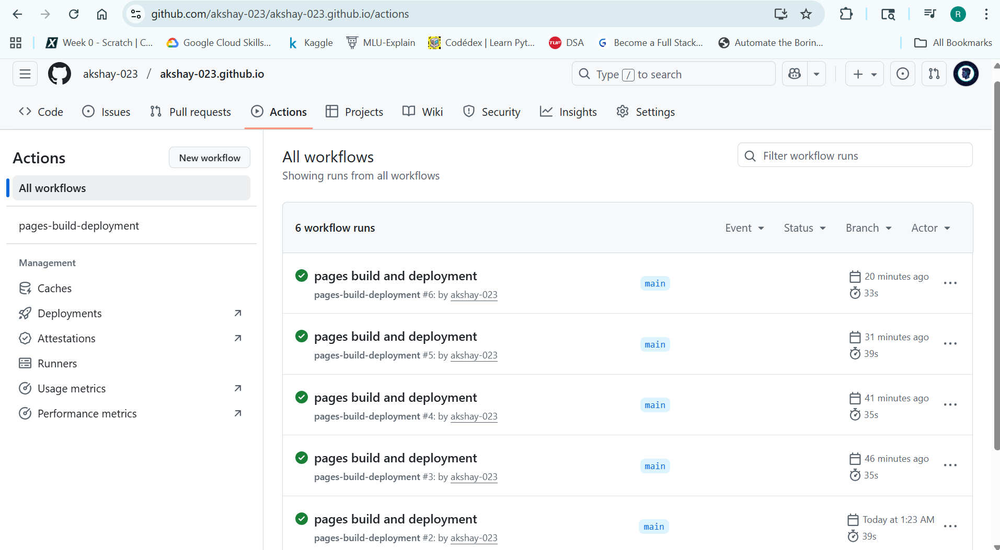
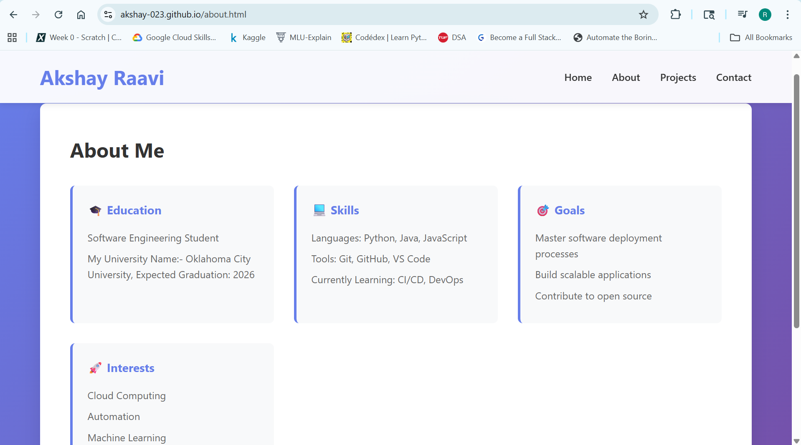
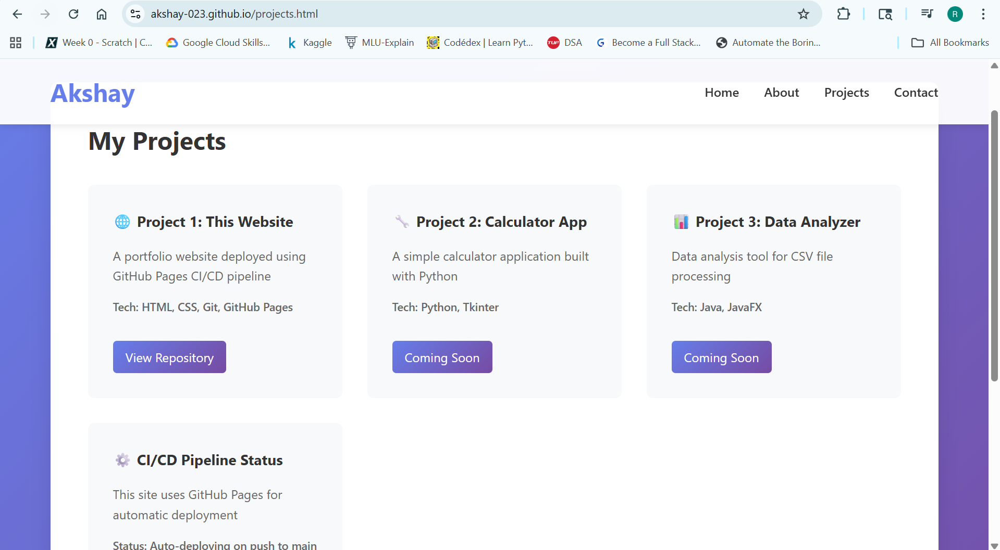
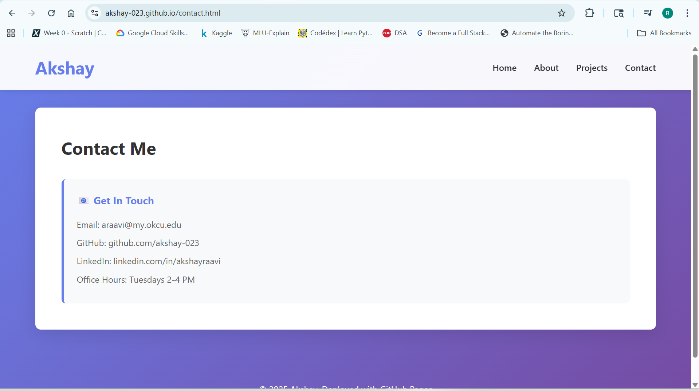

# CI/CD Pipeline Report

## Student Information

- Name: Akshay
- Date: [November 9, 2025]
- Repository: https://github.com/akshay-023/akshay-023.github.io
- Live URL: https://akshay-023.github.io

---

## Deployment History

Check the Actions tab for complete deployment history.

### Iteration Summary

1. **Initial Deployment**

   - Commit: [0058547]
   - Time to Deploy: [42 seconds]
   - Status: Success

2. **Iteration 1: Trello link**

   - Commit: [Commit hash for "Add link to project tracking trello board to README.md"]
   - Changes Made: Added link to Trello board in README.md.
   - Deployment Time: [35 seconds]

3. **Iteration 2: Deploy Info**

   - Commit: [Commit hash for "Iteration 2: Add deployment information"]
   - Changes Made: Added deploy-info.json and the CI/CD Status project card to projects.html.
   - Deployment Time: [39 seconds]

4. **Iteration 3: Feature Branch**
   - PR Number: # 1
   - Branch: feature/add-contact
   - Deployment triggered by: Pull Request merge to main branch

---

## CI/CD Understanding

### What is CI/CD?

**CI (Continuous Integration)** is the practice of constantly merging code changes into a main branch where automated builds and tests are immediately run. **CD (Continuous Deployment)** is the extension of this, where all validated code changes are automatically and instantly deployed to the production environment (like GitHub Pages).

### Benefits Observed

1. Instant deployment on push
2. Version control and rollback safety
3. No manual hosting setup required

### Challenges Faced

- Initial delay for GitHub Pages deployment
- Remembering to update navigation links
- Browser caching showing old versions

### Real-World Application

This pipeline is essential for large software projects. It ensures consistent, error-free deployment with every code merge, allowing teams to deliver new features rapidly and reliably. The feature branch workflow practiced here (PRs) also ensures code quality through required review before deployment.

---

## Screenshots

- [x] Initial deployment
      

- [x] GitHub Actions tab showing successful builds
      

- [x] Live website after final iteration (Includes views of About, Contact, and Projects pages)

  **About Page Proof:**
  

  **Projects Page Proof:**
  

  **Contact Page Proof:**
  
